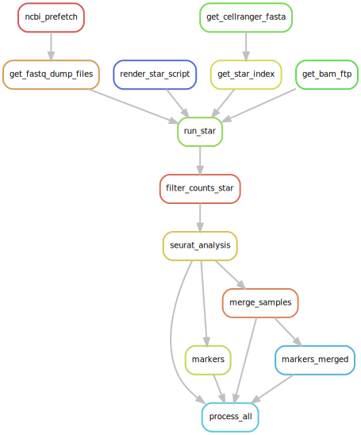

# Dataset analysis

*Above: Rule graph for complete data processing*

## Seurat Analysis

To analyze the scRNA-seq dataset, we create Seurat object and analyze all the samples that
are present in the dataset and only then merge samples together.

For full code of the Seurat analysis, please, refer to `workflow/scripts/seurat_analysis.R`.

In general, we can summarize the analysis pipeline in several steps.

* MiQC to remove cells with high mitochondrial content
* Normalization using SCTransform
* PCA
* tSNE + UMAP
* Clustering analysis (for several resolutions)

Then using different rule we perform differential expression test between clusters and
calculate averaged expression of genes in clusters.

When samples are analyzed with merge (`merge_samples`) them using the approach described
[here](https://satijalab.org/seurat/articles/integration_introduction.html#performing-integration-on-datasets-normalized-with-sctransform-1)
for samples processed with SCTransform.

The resulting files (`process_all`) for each dataset include:

* Seurat object for samples and merged dataset saved as RDS objects
* For all of these seurat objects, we calculate markers and averaged expression 
for different resolutions (0.2, 0.4, 0.6, 0.8, 1.0)

