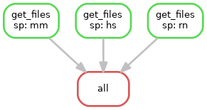

## scn-pipeline/find_sc

## Prerequisites

```commandline
conda install -y -c bioconda snakemake
```

## Repository structure

* `get_files.smk` -- snakemake pipeline
* `scripts/functions.py` -- functions for geo parsing
* `scripts/find_sc.py` -- script for geo parsing

## Pipeline structure



## Set some arguments

In params section of `get_files` rule of `get_files.smk` file,
specify both the `start_date` and `end_date`.

If you want to exclude some organism from analysis, remove its notation from `SPECIES` list.

## Code execution

```commandline
snakemake -j 3 -s get_files.smk --use-conda --conda-prefix $(pwd)
```

Conda environment corresponding to `find_sc.yml` will be installed in `$(pwd)` directory.

## Examine output

`sp` -- wildcard for organism:
```python
SPECIES =   {
            "mm": "Mus musculus",
            "rn": "Rattus norvegicus",
            "hs": "Homo sapiens"
            }
```

For example, wildcard `sp = mm` correspond to organism `Mus musculus`.

Output files:

```commandline
out/{sp}_study.tsv -- INFO AT STUDY LEVEL
out/{sp}_sample.tsv -- INFO AT SAMPLE LEVEL
out/{sp}_sample_annotated.tsv -- INFO AT METADATA LEVEL
```